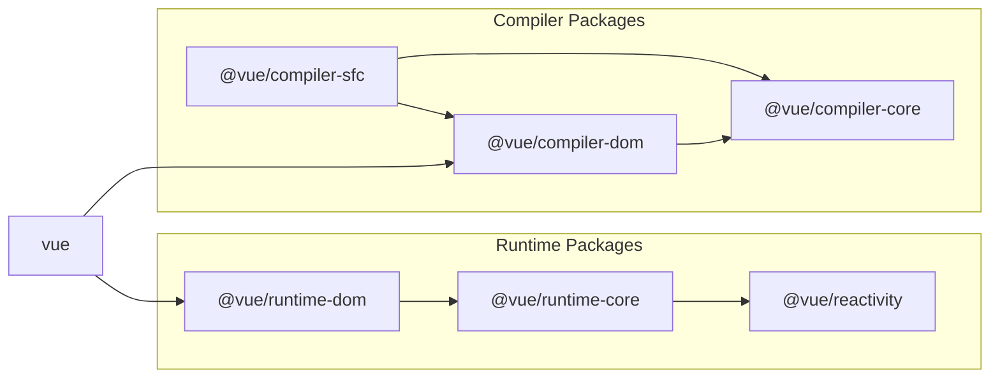

## mini-vue  

手撸实现Vue3核心模块

- reactivity
- compiler-core
- runtime-core

### Package Dependencies

```mermaid
  flowchart LR
    compiler-sfc["@vue/compiler-sfc"]
    compiler-dom["@vue/compiler-dom"]
    compiler-core["@vue/compiler-core"]
    vue["vue"]
    runtime-dom["@vue/runtime-dom"]
    runtime-core["@vue/runtime-core"]
    reactivity["@vue/reactivity"]

    subgraph "Runtime Packages"
      runtime-dom --> runtime-core
      runtime-core --> reactivity
    end

    subgraph "Compiler Packages"
      compiler-sfc --> compiler-core
      compiler-sfc --> compiler-dom
      compiler-dom --> compiler-core
    end

    vue ---> compiler-dom
    vue --> runtime-dom
```